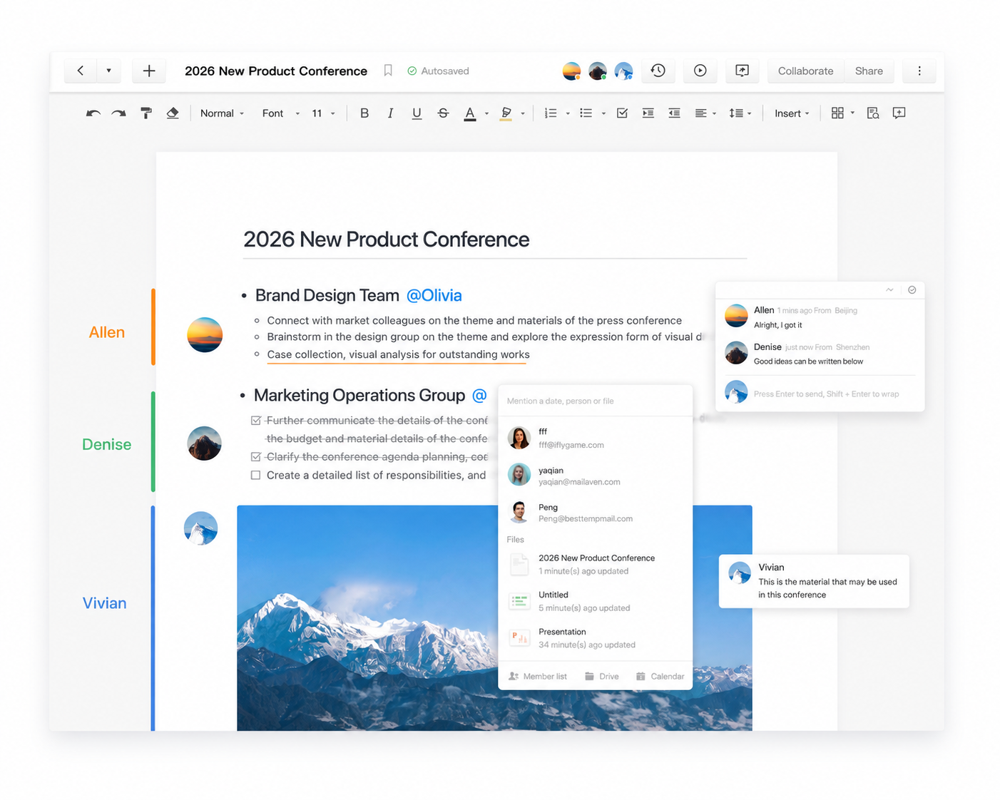
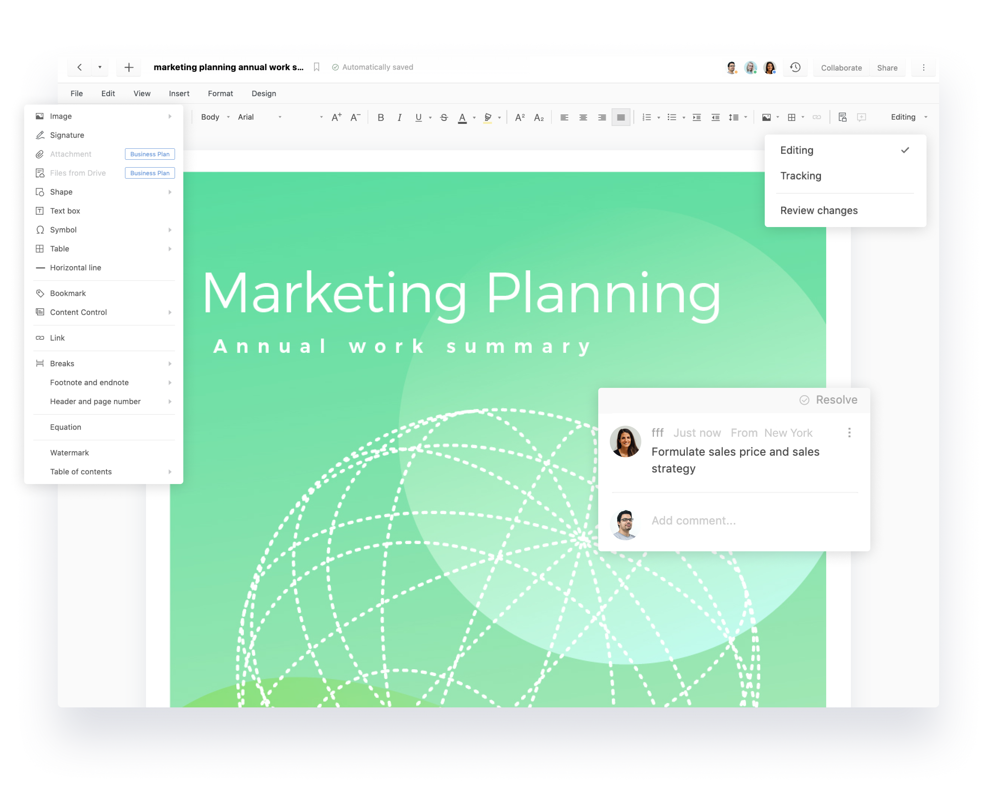
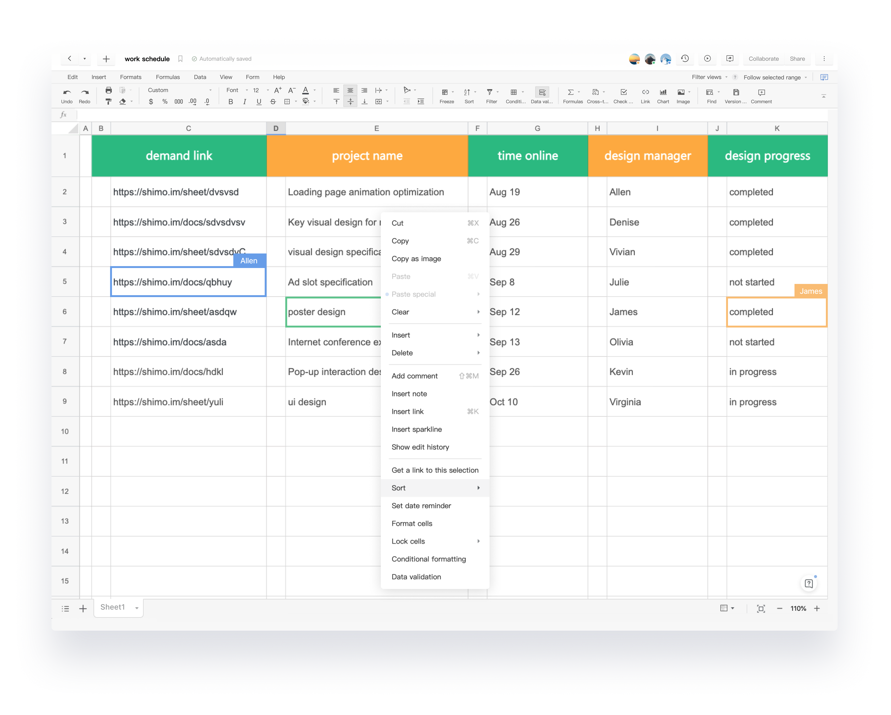
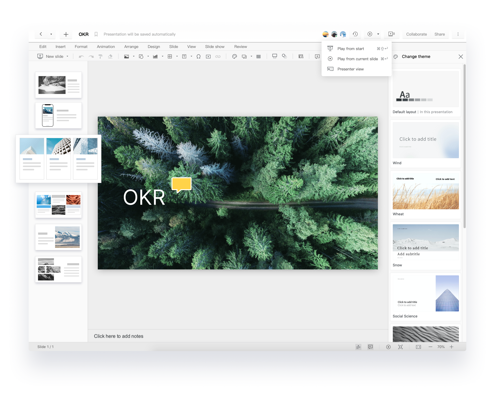
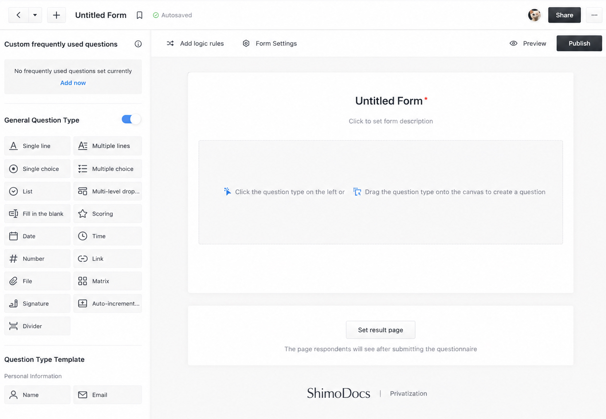
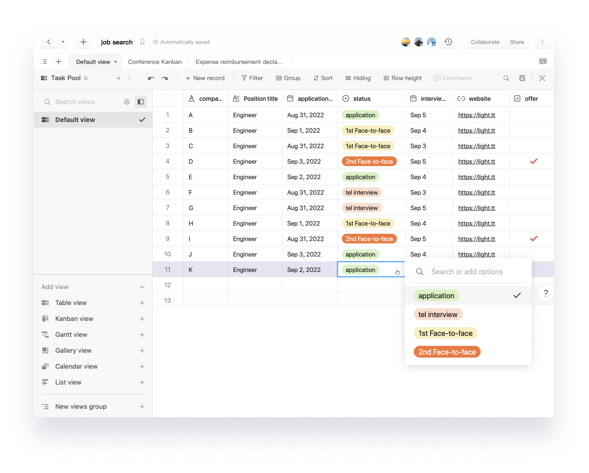

<h1> ShimoDocs</h1>

<h3>Tu nube. Tus documentos. Tu control.</h3>

ShimoDocs es una suite autoalojada de colaboración documental para documentos, escritura, hojas de cálculo, presentaciones, formularios y tablas en tiempo real en tu nube privada, con AI Agents configurables de forma privada e integrados en cada producto.

---

<a href="./README.md">English</a> · <a href="./readme-zh.md">简体中文</a> · <strong>Español</strong> · <a href="./README.de.md">Deutsch</a> · <a href="./README.fr.md">Français</a> · <a href="./README.ja.md">日本語</a> · <a href="./README.ko.md">한국어</a> · <a href="./README.vi.md">Tiếng Việt</a> · <a href="./README.th.md">ไทย</a>

 

## ¿Qué es ShimoDocs?

ShimoDocs es una suite de colaboración documental autoalojada que reúne documentos colaborativos, escritura profesional, hojas de cálculo, presentaciones, formularios y tablas estructuradas en tu nube privada. Ofrece a los equipos una experiencia familiar de colaboración en tiempo real similar a Google Docs, mientras mantiene bajo su control los datos empresariales, el acceso de los usuarios y el despliegue.

Crea, edita, comenta, revisa y comparte en un único espacio de trabajo, sin enviar archivos adjuntos, mantener múltiples versiones ni entregar contenido sensible a un servicio de nube pública.

<table>
<tr>
<td width="50%" valign="top">

### 🔒 Conserva los datos en tu entorno

Despliega ShimoDocs en tus servidores, nube privada o centro de datos. Tu organización gestiona los documentos y los datos de colaboración según sus propias políticas.

</td>
<td width="50%" valign="top">

### ✍️ Colaboración en tiempo real familiar

Edita en equipo y avanza con comentarios, respuestas, sugerencias, historial de versiones y uso compartido basado en permisos.

</td>
</tr>
<tr>
<td width="50%" valign="top">

### 🛡️ Administración y auditoría empresarial

Gestiona departamentos, usuarios y roles de forma centralizada, con permisos detallados, controles de uso compartido y registros de auditoría.

</td>
<td width="50%" valign="top">

### 🔌 Abierto y extensible

Conecta SSO, LDAP y Active Directory, e integra herramientas, flujos de trabajo y sistemas internos mediante API abiertas.

</td>
</tr>
</table>

## Conoce la suite ShimoDocs

Seis productos conectados cubren la colaboración diaria, los documentos extensos, el análisis de datos, las presentaciones, la recopilación de información y los flujos de trabajo estructurados.

<table>
<tr>
<td width="50%" valign="top">

### Document

Captura notas de reuniones, planes de proyecto, conocimiento del equipo y contenido enriquecido en un lienzo colaborativo flexible. Edita en tiempo real, menciona a compañeros, asigna tareas y conserva las conversaciones junto al contenido.

</td>
<td width="50%" valign="top">

### Writer

Crea informes, contratos, políticas, propuestas y otros documentos empresariales extensos. Utiliza formato de página profesional, revisión de cambios y gestión de contenido estructurado sin perder la fidelidad del documento.

</td>
</tr>
<tr>
<td width="50%" valign="top">

### Sheet

Organiza datos, calcula resultados, sigue proyectos y analiza información en equipo. Incluye fórmulas, formato, ordenación, filtros, gráficos, comentarios y edición multiusuario en tiempo real.

</td>
<td width="50%" valign="top">

### Presentation

Crea presentaciones atractivas con temas, diseños, contenido multimedia, animaciones, herramientas para el ponente y edición colaborativa, todo dentro del mismo espacio de trabajo.

</td>
</tr>
<tr>
<td width="50%" valign="top">

### Form

Crea encuestas, registros, solicitudes, formularios de opinión y procesos internos con preguntas flexibles, reglas lógicas, ajustes y páginas de resultados personalizadas.

</td>
<td width="50%" valign="top">

### Table

Gestiona información estructurada y procesos empresariales con vistas de tabla, Kanban, Gantt, galería, calendario y lista, además de filtros, grupos, campos flexibles y comentarios.

</td>
</tr>
</table>

Los seis productos trabajan juntos en un único espacio con la misma experiencia de AI Agent configurada de forma privada.

## Agentes de IA integrados en cada producto

Cada producto de ShimoDocs incluye una barra lateral de AI Agent. La IA trabaja dentro del documento, la hoja de cálculo, la presentación, el formulario o la tabla donde ya se realiza el trabajo, no en una herramienta separada que pierde el contexto actual.

Tu organización puede configurar de forma privada cualquier AI Agent, modelo, herramienta y fuente de conocimiento aprobados, controlando el acceso y los límites de los datos. Los equipos pueden utilizar los servicios de IA que cumplen sus requisitos de seguridad, conformidad y despliegue sin quedar vinculados a un único proveedor público.

<table>
<tr>
<td width="33%" valign="top">

### 🤖 En toda la suite

La misma barra lateral de AI Agent está disponible en Document, Writer, Sheet, Presentation, Form y Table.

</td>
<td width="33%" valign="top">

### 🔐 Configuración privada

Conecta los AI Agents, modelos, herramientas y conocimientos aprobados por tu organización con tus propias políticas de acceso y controles de datos.

</td>
<td width="33%" valign="top">

### ⚡ Responses, no solo chat

ShimoDocs utiliza un **modo Responses** orientado a agentes, no un simple chat estilo Copilot. El Agent trabaja con el contenido actual, gestiona solicitudes de varios pasos, utiliza herramientas y contexto configurados, y entrega resultados terminados y estructurados dentro del flujo de trabajo.

</td>
</tr>
</table>

## 5 usuarios gratis para siempre

> [!IMPORTANT]
> ShimoDocs es **gratis para siempre para 5 usuarios**. La licencia gratuita incluye los seis productos y la experiencia completa de colaboración en tiempo real, sin tarjeta de crédito. Despliégalo en tus servidores, nube privada o centro de datos para que tus datos permanezcan en tu entorno.

| Plan gratuito | Detalles |
| --- | --- |
| 👥 Tamaño del equipo | 5 usuarios, gratis para siempre |
| 🧰 Productos incluidos | Document, Writer, Sheet, Presentation, Form y Table |
| 🤝 Colaboración | Edición en tiempo real, comentarios, revisión, uso compartido y permisos |
| 💳 Tarjeta de crédito | No requerida |
| 📦 Instalador | Descarga desde GitHub Releases |
| 🔑 Licencia | Solicítala gratis escribiendo a `support.global@shimo.im` |
| 🏠 Despliegue | Tus servidores, nube privada o centro de datos |

> Los costes del servidor, los recursos en la nube y el alojamiento son responsabilidad del cliente y no están incluidos en la licencia de ShimoDocs.

## Despliegue privado en cuatro pasos

1. Descarga el instalador más reciente desde [GitHub Releases](https://github.com/shimodocs/shimodocs/releases).
2. Sigue las instrucciones de la versión para desplegar ShimoDocs en tus servidores, nube privada o centro de datos.
3. Escribe a [support.global@shimo.im](mailto:support.global@shimo.im) para solicitar tu licencia gratuita permanente para 5 usuarios.
4. Activa la licencia, crea un espacio de trabajo e invita a tu equipo.

## ShimoDocs frente a Google Docs

> La experiencia de colaboración familiar de Google Docs, con la seguridad, el control y la flexibilidad del despliegue privado.

### Más control. Más seguridad. Solo con Shimo.

| Función | ShimoDocs | Google Docs |
| --- | :---: | :---: |
| **Despliegue privado** Despliega en tus servidores o nube privada. | ✅ Sí | Solo nube pública |
| **Propiedad total de los datos** Tus datos permanecen en tu entorno. | ✅ Sí | Gestionados por Google |
| **SSO y directorio empresarial** Integra SSO, LDAP, AD y más. | ✅ Sí | Limitado |
| **Registros de auditoría y cumplimiento** Registros detallados para seguridad y cumplimiento. | ✅ Sí | Limitado |
| **Controles administrativos avanzados** Políticas y controles administrativos detallados. | ✅ Sí | Controles básicos |
| **API abierta y extensibilidad** API para integraciones y automatización personalizadas. | ✅ Sí | Limitado |

### La experiencia de colaboración que ya conoces.

| Función | ShimoDocs | Google Docs |
| --- | :---: | :---: |
| **Colaboración en tiempo real** Editad juntos en tiempo real. | ✅ Sí | ✅ Sí |
| **Edición de documentos familiar** Experiencia de edición similar a Docs. | ✅ Sí | ✅ Sí |
| **Comentarios y sugerencias** Comenta, responde y sugiere cambios. | ✅ Sí | ✅ Sí |
| **Uso compartido y permisos** Comparte de forma segura con acceso para ver, editar o comentar. | ✅ Sí Controles avanzados | ✅ Sí Controles básicos |

ShimoDocs ofrece la experiencia de colaboración que tu equipo ya conoce, con más control sobre el despliegue, los datos, los permisos y las integraciones.

## ¿Para quién es ShimoDocs?

- **Startups y equipos pequeños:** crea un espacio de colaboración compartido con un coste inicial menor.
- **Proyectos de código abierto y equipos técnicos:** mantén hojas de ruta, diseños, planes de lanzamiento y conocimiento del proyecto.
- **Organizaciones que priorizan la privacidad:** mejora la colaboración sin renunciar al control sobre la ubicación y el acceso a los datos.
- **Sectores regulados y grandes empresas:** obtén despliegue privado, integración de identidades, permisos detallados y auditoría.
- **Equipos distribuidos e internacionales:** comunica, revisa y avanza trabajando siempre sobre la versión actual.

## Preguntas frecuentes

<strong>¿ShimoDocs es realmente gratuito?</strong>

Sí. Un equipo de 5 usuarios puede escribir a [support.global@shimo.im](mailto:support.global@shimo.im) para solicitar una licencia gratuita permanente, sin tarjeta de crédito. Los equipos más grandes pueden elegir un plan de pago según su tamaño.

<strong>¿Necesito mi propio servidor?</strong>

Sí. ShimoDocs se ejecuta en tu entorno privado, por lo que tu organización proporciona y gestiona los servidores, la nube privada u otra infraestructura. Si aún no quieres desplegarlo, empieza con una [prueba en línea](https://shimodocs.com/#online-trial).

<strong>¿En qué se diferencia ShimoDocs de Google Docs?</strong>

ShimoDocs ofrece una experiencia familiar de edición en tiempo real dentro de tu entorno privado. Tu organización conserva un mayor control sobre la ubicación de los datos, los sistemas de identidad, los permisos, los registros de auditoría y las integraciones.

<strong>¿Podemos conectar nuestros servicios de IA?</strong>

Sí. ShimoDocs puede conectarse a los servicios de IA elegidos por tu organización para redactar, resumir, reescribir y traducir, mientras el equipo gestiona su uso según sus propias políticas.

## Basado en experiencia empresarial real

ShimoDocs cuenta con más de 12 años de experiencia en colaboración documental y ha prestado servicio a miles de equipos, incluidas empresas como DiDi, Baidu, TCL y OPPO. Las necesidades reales de colaboración, seguridad, permisos y administración constituyen la base de la plataforma de nube privada ShimoDocs disponible hoy para equipos de todo el mundo.

---

### ¿Listo para devolver tus documentos a tu propia nube?

**5 usuarios gratis para siempre · Sin tarjeta de crédito · Los datos permanecen en tu entorno**

[**Descargar paquete**](https://github.com/shimodocs/shimodocs/releases) · [**Solicitar licencia gratuita**](mailto:support.global@shimo.im) · [**Prueba en línea**](https://shimodocs.com/#online-trial) · [**Contactar con ventas**](https://shimodocs.com/contact)

[Sitio web](https://shimodocs.com/) · [Precios](https://shimodocs.com/pricing) · [Comparación](https://shimodocs.com/comparison) · [Privacidad](https://shimodocs.com/legal-page/privacy-policy) · [Condiciones](https://shimodocs.com/legal-page/terms-conditions)

Licencias: [support.global@shimo.im](mailto:support.global@shimo.im) · Soporte: [support.global@shimo.im](mailto:support.global@shimo.im)

