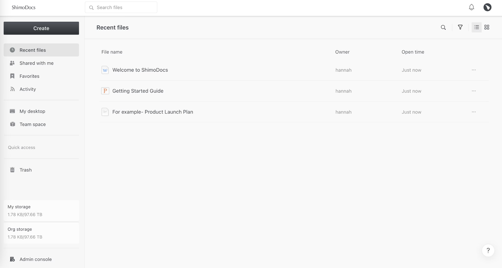
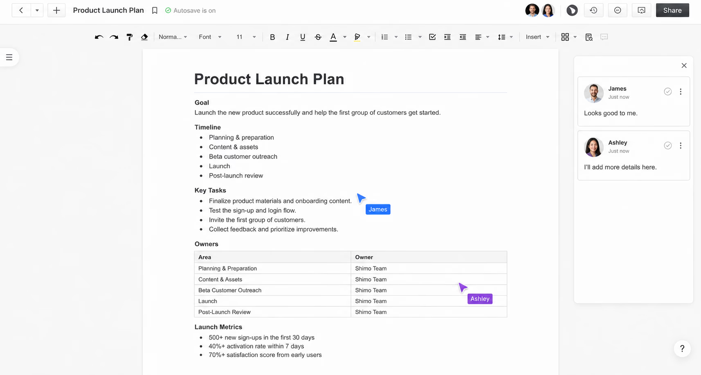
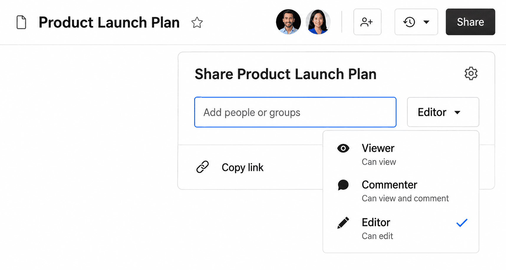
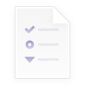
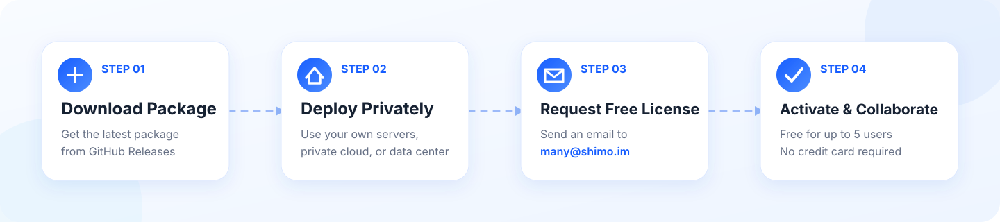

<h1>ShimoDocs</h1>

<h3>당신의 클라우드. 당신의 문서. 당신의 통제권.</h3>

ShimoDocs는 프라이빗 클라우드에서 문서, 워드 프로세싱, 스프레드시트, 프레젠테이션, 양식, 테이블을 제공하며 모든 제품에 비공개로 구성 가능한 AI Agent가 내장된 셀프 호스팅 문서 협업 제품군입니다.

---

<a href="./README.md">English</a> · <a href="./readme-zh.md">简体中文</a> · <a href="./README.es.md">Español</a> · <a href="./README.de.md">Deutsch</a> · <a href="./README.fr.md">Français</a> · <a href="./README.ja.md">日本語</a> · <strong>한국어</strong> · <a href="./README.vi.md">Tiếng Việt</a> · <a href="./README.th.md">ไทย</a>

[**다운로드**](https://github.com/shimodocs/shimodocs/releases) · [**온라인 체험**](https://shimodocs.com/#online-trial) · [웹사이트](https://shimodocs.com/)

> [!IMPORTANT]
> ShimoDocs는 **프라이빗 환경에 배포하는** 문서 협업 플랫폼입니다. [GitHub Releases](https://github.com/shimodocs/shimodocs/releases)에서 설치 패키지를 다운로드하여 자체 인프라에 배포한 뒤, [support.global@shimo.im](mailto:support.global@shimo.im)로 이메일을 보내 최대 5인 무료 라이선스를 신청하세요. 아직 배포할 준비가 되지 않았다면 [온라인 체험](https://shimodocs.com/#online-trial)을 이용할 수 있습니다.

## 협업을 위해 만들고, 통제권을 위해 설계했습니다.

ShimoDocs는 Google Docs와 같은 실시간 협업 경험에 프라이빗 배포, 기업용 권한 관리, 비즈니스 데이터 통제 기능을 결합합니다. 첨부 파일을 주고받거나 여러 버전을 관리하지 않고도 하나의 워크스페이스에서 콘텐츠를 작성, 편집, 댓글, 검토, 공유할 수 있습니다.

<table><tr><td width="50%" valign="top">

### 🔒 데이터를 자체 환경에 보관

자체 서버, 프라이빗 클라우드 또는 데이터 센터에 배포하세요. 조직의 정책에 따라 문서와 협업 데이터를 직접 관리할 수 있습니다.

</td><td width="50%" valign="top">

### ✍️ 익숙한 실시간 협업

여러 사용자가 동시에 편집하고 댓글, 답글, 제안, 버전 기록, 권한 기반 공유를 통해 업무를 진행할 수 있습니다.

</td></tr><tr><td width="50%" valign="top">

### 🛡️ 기업용 관리 및 감사

부서, 사용자, 역할을 중앙에서 관리하고 세분화된 권한, 공유 제어, 감사 로그를 활용하세요.

</td><td width="50%" valign="top">

### 🔌 개방성과 확장성

SSO, LDAP, Active Directory를 연결하고 오픈 API로 기존 도구, 워크플로 및 사내 시스템을 통합할 수 있습니다.

</td></tr></table>

## 실제 협업 화면

  

실시간 편집, 댓글, 공유 컨텍스트를 통해 모든 사용자가 항상 최신 버전에서 작업합니다.

뷰어, 댓글 작성자, 편집자 역할을 사용하여 문서별 접근 권한을 정밀하게 제어합니다.

## 하나의 플랫폼, 여섯 가지 핵심 도구

| | 도구 | 주요 사용 사례 |
| :---: | --- | --- |
|  | **Document** | 회의록, 프로젝트 계획, 팀 지식 및 일상 협업 |
|  | **Writer** | 보고서, 계약서, 정책 및 복잡한 서식의 문서 |
|  | **Sheet** | 데이터 정리, 계산, 분석, 계획 및 추적 |
|  | **Presentation** | 프로젝트 보고, 제안서 및 팀 프레젠테이션 |
|  | **Form** | 정보 수집, 설문, 등록 및 피드백 |
|  | **Table** | 구조화된 정보 관리 및 유연한 비즈니스 워크플로 |

조직이 승인한 AI 서비스를 연결하여 초안 작성, 요약, 재작성, 번역에 활용할 수도 있으며, AI 사용 방식은 조직의 정책에 따라 관리할 수 있습니다.

## 4단계 프라이빗 배포

1. [GitHub Releases](https://github.com/shimodocs/shimodocs/releases)에서 최신 설치 패키지를 다운로드합니다.
2. Release에 포함된 안내에 따라 자체 서버, 프라이빗 클라우드 또는 데이터 센터에 배포합니다.
3. [support.global@shimo.im](mailto:support.global@shimo.im)로 이메일을 보내 5인 무료 라이선스를 신청합니다.
4. 라이선스를 활성화하고 워크스페이스를 만든 뒤 팀원을 초대합니다.

> 서버, 클라우드 리소스 및 호스팅 비용은 사용자가 부담하며 ShimoDocs 라이선스에 포함되지 않습니다.

## 최대 5인 팀 무료

| 무료 플랜 | 내용 |
| --- | --- |
| 👥 팀 규모 | 최대 5명 |
| 🧰 제품 기능 | 전체 협업 기능 포함 |
| 💳 신용카드 | 불필요 |
| 📦 설치 패키지 | GitHub Releases에서 다운로드 |
| 🔑 라이선스 | `support.global@shimo.im`로 이메일을 보내 무료 신청 |
| 🏠 배포 위치 | 자체 서버, 프라이빗 클라우드 또는 데이터 센터 |

소규모 팀은 먼저 모든 구성원이 하나의 공유 공간에서 협업하고, 팀 성장에 따라 업그레이드 시점을 결정할 수 있습니다.

## ShimoDocs와 Google Docs 비교

> Google Docs의 익숙한 협업 경험에 프라이빗 배포의 보안, 통제력, 유연성을 더했습니다.

### 더 많은 통제력. 더 강력한 보안. Shimo만의 차이.

| 기능 | ShimoDocs | Google Docs |
| --- | :---: | :---: |
| **프라이빗 배포** 자체 서버 또는 프라이빗 클라우드에 배포. | ✅ 지원 | 퍼블릭 클라우드 전용 |
| **완전한 데이터 소유권** 데이터를 자체 환경에 보관. | ✅ 지원 | Google이 관리 |
| **SSO 및 기업 디렉터리** SSO, LDAP, AD 등 통합. | ✅ 지원 | 제한적 |
| **감사 로그 및 규정 준수** 보안 및 규정 준수를 위한 상세 로그. | ✅ 지원 | 제한적 |
| **고급 관리자 제어** 세분화된 관리 정책과 제어. | ✅ 지원 | 기본 제어 |
| **오픈 API 및 확장성** 맞춤형 통합과 자동화를 위한 API. | ✅ 지원 | 제한적 |

### 이미 익숙한 협업 경험.

| 기능 | ShimoDocs | Google Docs |
| --- | :---: | :---: |
| **실시간 협업** 여러 사용자가 실시간으로 함께 편집. | ✅ 지원 | ✅ 지원 |
| **익숙한 문서 편집** Docs와 유사한 편집 경험. | ✅ 지원 | ✅ 지원 |
| **댓글 및 제안** 댓글, 답글, 변경 제안. | ✅ 지원 | ✅ 지원 |
| **공유 및 권한** 보기, 편집, 댓글 권한으로 안전하게 공유. | ✅ 지원 고급 제어 | ✅ 지원 기본 제어 |

ShimoDocs는 익숙한 협업 경험을 제공하면서 배포, 데이터, 권한, 통합에 대한 더 많은 통제권을 제공합니다.

## ShimoDocs가 적합한 팀

- **스타트업 및 소규모 팀:** 낮은 초기 비용으로 공동 협업 공간을 구축합니다.
- **오픈소스 프로젝트 및 기술 팀:** 로드맵, 설계 문서, 릴리스 계획, 프로젝트 지식을 함께 관리합니다.
- **개인정보 보호를 중시하는 조직:** 데이터 위치와 접근 권한을 통제하면서 협업을 개선합니다.
- **규제 산업 및 대기업:** 프라이빗 배포, ID 통합, 세분화된 권한, 감사 기능을 활용합니다.
- **분산 및 글로벌 팀:** 항상 최신 버전에서 소통하고 검토하며 업무를 진행합니다.

## 자주 묻는 질문

<strong>ShimoDocs는 정말 무료인가요?</strong>

네. 최대 5인 팀은 [support.global@shimo.im](mailto:support.global@shimo.im)로 이메일을 보내 신용카드 없이 무료 라이선스를 신청할 수 있습니다. 5명을 초과하는 팀은 규모에 맞는 유료 플랜을 선택할 수 있습니다.

<strong>자체 서버가 필요한가요?</strong>

네. ShimoDocs는 프라이빗 환경에서 실행되므로 조직이 서버, 프라이빗 클라우드 또는 기타 인프라를 제공하고 관리해야 합니다. 아직 배포할 준비가 되지 않았다면 [온라인 체험](https://shimodocs.com/#online-trial)을 이용하세요.

<strong>Google Docs와 무엇이 다른가요?</strong>

ShimoDocs는 자체 프라이빗 환경에서 익숙한 실시간 편집 경험을 제공합니다. 조직은 데이터 위치, ID 시스템, 접근 권한, 감사 기록, 통합을 더 세밀하게 통제할 수 있습니다.

<strong>기존 AI 서비스를 연결할 수 있나요?</strong>

네. 조직이 선택한 AI 서비스를 연결하여 초안 작성, 요약, 재작성, 번역에 활용할 수 있으며, AI 사용 방식은 자체 정책에 따라 관리할 수 있습니다.

## 실제 기업 협업 경험을 기반으로 구축

ShimoDocs는 12년 이상의 문서 협업 경험을 보유하고 있으며 DiDi, Baidu, TCL, OPPO를 포함한 수천 개 팀에 서비스를 제공했습니다. 실제 조직의 협업, 보안, 권한, 관리 요구 사항이 오늘날 전 세계 팀을 위한 ShimoDocs 프라이빗 클라우드 플랫폼의 기반입니다.

---

### 문서를 자체 클라우드로 가져올 준비가 되셨나요?

**최대 5명 무료 · 신용카드 불필요 · 데이터는 자체 환경에 보관**

[**패키지 다운로드**](https://github.com/shimodocs/shimodocs/releases) · [**무료 라이선스 신청**](mailto:support.global@shimo.im) · [**온라인 체험**](https://shimodocs.com/#online-trial) · [**영업팀 문의**](https://shimodocs.com/contact)

[웹사이트](https://shimodocs.com/) · [요금](https://shimodocs.com/pricing) · [비교](https://shimodocs.com/comparison) · [개인정보 처리방침](https://shimodocs.com/legal-page/privacy-policy) · [이용약관](https://shimodocs.com/legal-page/terms-conditions)

라이선스 신청: [support.global@shimo.im](mailto:support.global@shimo.im) · 지원: [support.global@shimo.im](mailto:support.global@shimo.im)

