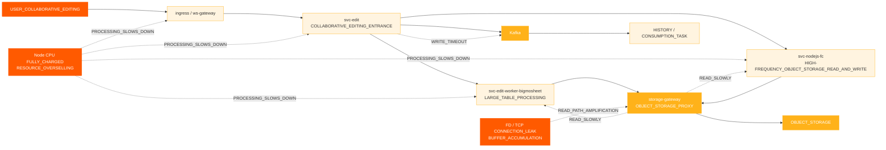
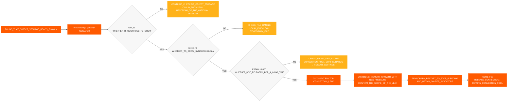
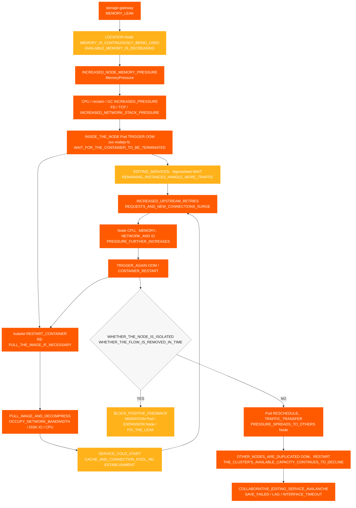

# 协作编辑事件

[← ShimoDocs Suite 部署文档](../README.md)

## 1. 案例背景 

一家大型公司的环境经历了一次协作编辑不可用类型的事件，影响了用户对部分电子表格和文档的正常编辑和保存。在事件期间，用户遇到了保存失败、编辑延迟以及 Kafka 写入超时等现象；在服务端，则出现了对象存储读取缓慢、节点使用异常以及 CPU /FD指标异常 TCP等问题。 

此案例说明，协作编辑不可用不一定直接由编辑服务本身引起，也可能因底层资源超售、节点调度集中、中间件写入变慢、对象存储读取路径异常或连接泄露等问题共同放大。 

## 2. 事件表现 

此次事件的主要影响如下： 

- 协作编辑链接无法使用、响应缓慢或界面超时。 
- 部分电子表格或文档无法正常保存。 
- 编辑端弹窗出现。 `Kafka write timeout`. 
- 对象存储读取时间增加，进一步影响了编辑链接的处理。 
- Pod 监控显示正常，但用户持续报告保存失败、编辑延迟和界面超时。 

## 3. 初步调查过程 

### 3.1 从用户现象入手，进入编辑链接调查 

客户最初报告部分文档异常，因此初步调查集中于协作编辑问题： 
1. 检查编辑和保存链接。 
2. 检查相关服务日志。 

3. 检查 Kafka 写入状态。 
4. 检查对象存储读/写延迟。 

在调查过程中，发现了两个主要异常： 

- `Kafka write timeout` 编辑链接中出现异常。 
- 对象存储读取延迟异常。 

### 3.2 对外部依赖的初步确认 

在调查过程中，我们与外部依赖负责人逐一确认： 

- 已与对象存储方确认，云服务提供方未发现明显问题。 
- 已与 Kafka 运维确认，集群端未发现明显问题。 Kafka 集群端未发现明显问题。 

因此，这个问题不能直接归因于对象存储或 Kafka 服务本身，并且需要进一步调查本地业务节点、网关、连接池、网络和资源层。 

### 3.3 从 Pod 监控转向节点监控 

最初，在检查 Pod 监控时，两者都 CPU 和内存处于相对安全的范围内，但客户报告节点 CPU 已达到最大使用率。 

这是当前诊断的关键转折点： 

- 在资源超额分配的情况下，Pod 监控可能无法准确反映节点压力。 
- 一旦节点 CPU 达到最大负荷，容器内的业务处理能力将下降。 
- 在业务处理变慢之后，它进一步表现为对象存储读取缓慢，缓慢 Kafka 写入、请求积压和保存失败。 

## 4. 故障影响链 

## 5. 主要发现 

### 5.1 节点 CPU 异常情况 

多个节点经历了 CPU 顺序异常： 
- '10.142.191.54' 在 18:20 发生异常。 
- '10.76.176.65' 在 18:30 发生异常。 
- '10.76.238.202' 在 18:40 发生异常。 
- '10.142.206.216' 在 18:42 发生异常。 
- '10.142.175.191' 在 18:45 发生异常。 

可以看出，第一个异常是 '10.142.191.54'，随后是 CPU 在其他节点上的问题，这与单点资源异常传播到多个节点的特征相符。 

### 5.2 CPU 和内存超售 

故障前后的资源超售情况如下： 

| 场景 | 资源 | 集群容量 | 总请求 | 请求比例 | 总限制 | 超卖 |
| --- | --- | --- | --- | --- | --- | --- |
| nodejs-fc pod 6 | CPU | 192 核心 | 33.75 核心 | 17.6% | 457 核心 | 238.0% |
| nodejs-fc pod 6 | 内存 | 768 GiB | 57.24 GiB | 7.5% | 884 GiB | 115.1% |
| nodejs-fc pod 12 | CPU | 192 核心 | 45.75 核心 | 23.8% | 493 核心 | 256.8% |
| nodejs-fc pod 12 | 内存 | 768 GiB | 81.24 GiB | 10.6% | 980 GiB | 127.6% |
| nodejs-fc pod 12 扩容后 | CPU | 320 核心 | 45.75 核心 | 14.3% | 493 核心 | 154.1% |
| nodejs-fc pod 12 扩容后 | 内存 | 1280 GiB | 81.24 GiB | 6.3% | 980 GiB | 76.6% |

在正常情况下， CPU 超额认购控制在约150%是相对可以接受的。在此次扩容之前， CPU 超额认购已经达到了238%，在规模翻倍后，达到了256.8%，存在突发流量雪崩的高风险。 

### 5.3 Pod 调度集中度 

默认情况下 K8s 大型公司环境中的默认调度策略倾向于在使用剩余节点之前先填满一个节点。在服务滚动部署或临时扩容期间，多个高负载服务容易集中在少数节点上。 

高风险组合包括： 

- 多个 `svc-nodejs-fc` 实例存在于单个节点上。 
- 正在运行 `svc-edit-worker-bigmosheet` 以及 `ingress` 在同一个节点上同时运行。 
- 叠加 `storage-gateway` 会导致连接泄漏或内存增加。 

### 5.4 存储网关连接和内存泄漏 

经过进一步检查节点 TCP 监控和 `storage-gateway` Pod 指标发现： 

- `total_fd` 持续增加。 
- `socket_fd` 持续增加。 
- TCP 连接保持 `ESTABLISHED` 时间较长。 
- 连接未及时释放，FD 未返回到连接池。 
- Pod RSS / 工作集持续增长，并且在回收后无法恢复到正常水平。 

如果 `total_fd`, `socket_fd`，并且内存使用量全部同时持续增加，这表明连接未释放且内存持续增长，应作为连接和内存泄漏处理，同时注意 Node 的 `MemoryPressure` 以及 OOM 风险。 

### 5.5 版本差异影响 

在旧版本中，图片附件数据直接写入数据表。在新版本中，为了减少 MySQL 使用量和存储成本，图片附件信息写入对象存储元数据，并使用直接访问对象存储的 `/x` 读取路径。 

在代理模式下，用于判断对象存储键是否存在的底层功能未正确释放连接，导致连接泄漏。该问题结合资源过度分配和集中调度，放大为协作编辑不可用的故障。 

### 5.6 对象存储和存储网关监控证据 

为了确定问题出在对象存储端、业务服务端还是代理层，对对象存储和 `storage-gateway` 进行了比较调查： 

- 对象存储读取延迟增加，而写入延迟相对正常，异常主要集中在读取路径。 
- CPU, RSS / 工作集，以及 `storage-gateway` Pods 的内存增长率持续增加。 
- `total_fd` 以及 `socket_fd` 继续增长，且 TCP 连接长时间保持在 `ESTABLISHED` 状态。 
- 连接未及时释放，文件描述符未返回到连接池，导致内存压力和 OOM 节点上的风险。 
- 在对象存储端未发现与业务异常规模相匹配的服务器端故障，因此调查重点被优先放在 `storage-gateway` 代理读取路径上。 

综合判断：对象存储读取缓慢不仅仅是由于对象存储服务故障，而是FD累积的结果， TCP 由……引起的连接、内存和节点资源压力 `storage-gateway` 连接未被释放。 

### 5.7 FD/TCP 泄漏判定过程 

这次，使用了以下判断链来确认 `storage-gateway` 有连接泄漏： 

判决结论：当 `total_fd`, `socket_fd`，数量为 `ESTABLISHED` 连接数和 Pod 内存使用量在同一时间窗口同步增加时，主要根本原因可以认为是“由于未释放连接导致的 FD/TCP 和内存泄漏”；如果对象存储读取速度较慢而写入正常，并且上述指标同时异常，应首先检查代理读取路径。 

## 6. 根本原因结论 

此故障的根本原因链是： 

1. 该集群具有显著性 CPU 过度提交，带有 CPU 在某些阶段过度分配超过250%。 
2. 在服务滚动更新或临时扩缩容期间，Pod调度集中，导致单个节点资源压力过大。 
3. 高负载服务例如 `svc-nodejs-fc`, `svc-edit-worker-bigmosheet`和 `ingress` 集中在某些节点。 
4. `storage-gateway` 在对象存储代理读取路径中存在连接释放问题，导致 FD、 TCP 连接和内存使用量持续增长。 
5. 在内存压力之后以及 OOM 节点上发生容器重启、镜像拉取、服务冷启动，以及上游重试进一步增加 CPU，网络和磁盘 IO 压力，导致对象存储读取缓慢以及 Kafka 写入缓慢。 
6. 对象存储读取缓慢和 Kafka 写入超时最终表现为协作编辑不可用、保存失败和编辑延迟。 

## 7. 节点资源雪崩传播图 

涉及此故障的业务服务都运行在 K8s 集群中。 `storage-gateway` 中的内存泄漏首先消耗其节点的可用内存，然后通过 OOM容器重启、镜像拉取、服务冷启动以及上游重试，形成资源消耗的正反馈循环。当异常 Pod 被重新调度或流量被转移到其他节点时，压力继续扩散到健康节点，最终引发集群级别的雪崩。 

该图需要关注两个放大循环： 

1. **节点内部正反馈循环**: OOM → kubelet 重启或拉取镜像 → 冷启动 → 上游重试和新连接增加 → CPU，内存、网络和磁盘 IO 压力持续上升 → OOM 再次出现。 
2. **跨节点扩散循环**：异常节点上的 Pods 被重新调度，入口流量被转移，或者剩余实例接管请求 → 健康节点负载增加 → 其他节点经历 OOM 并反复重启 → 集群可用容量持续下降。 

## 8. 处理与修复 

### 8.1 短期处理 

- 移除异常入口或异常节点的网关流量，以防止新流量进入高压路径。 
- 使用 FD 重启异常服务， TCP或持续增长的内存。 
- 将高负载 Pod 从高压节点迁移或分散。 
- 驱逐 Pods 或隔离资源已满的节点 CPU. 
- 避免仅扩展业务 Pods，应优先补充节点资源。 
- 为 `svc-edit` 同步接口新增快速失败能力，以防请求长时间堆积。 

### 8.2 长期修复 

- 在检查对象存储代理模式下 Key 是否存在时，修复未释放连接的问题。 
- 为核心服务配置反亲和策略，以避免将高风险服务集中在同一节点上。 
- 配置节点驱逐策略，以防止节点在资源耗尽后继续运行核心服务。 
- 建立 CPU 和内存超额分配监控。 
- 在扩展服务之前，必须评估客户环境的资源水平，并与项目负责人确认扩展计划。 
- 设置以下的告警 OOM, FD, TCP, 慢请求, Kafka 积压，以及核心服务的对象存储读/写延迟。 

## 9. 案例复盘结论 

此故障表明，当协作编辑不可用时，调查不应仅集中在编辑服务日志上。如果底层节点资源已经完全使用，业务服务整体将变慢，表现为多个上层症状，如 Kafka 写入超时、对象存储读取缓慢和保存失败。 

在将来处理类似问题时，应首先确认集群和节点资源，然后逐步检查中间件、业务监控、日志和跟踪链路，以避免从单个服务日志开始调查而陷入局部排查循环。 

---
