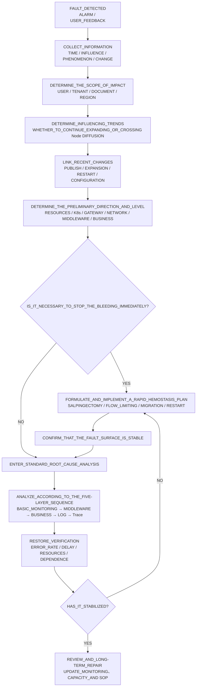
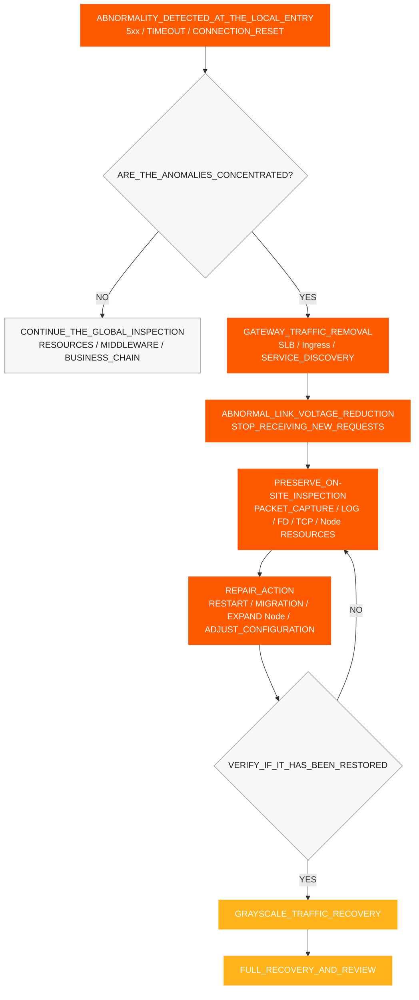
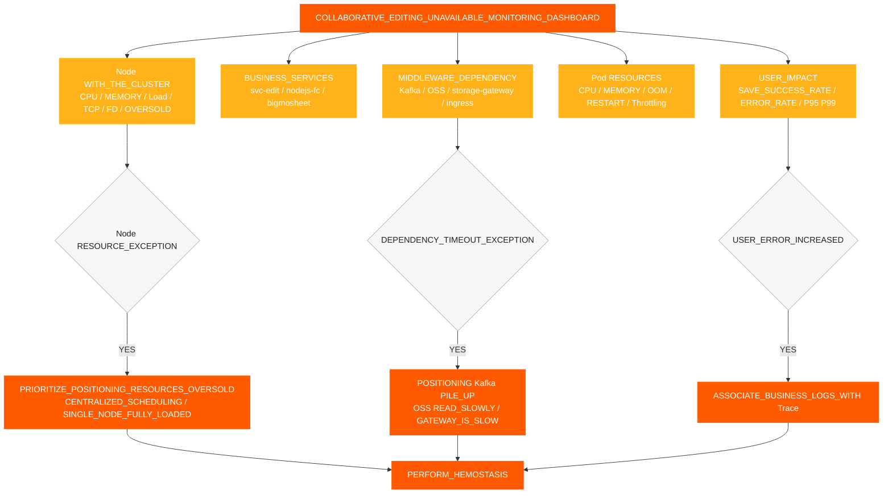
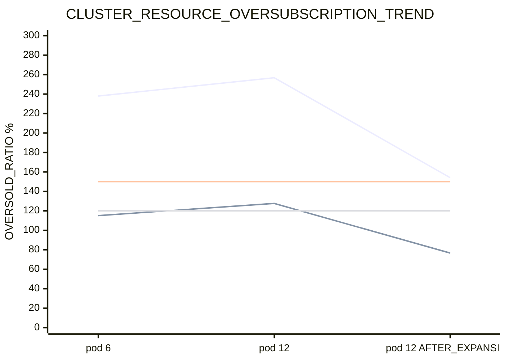
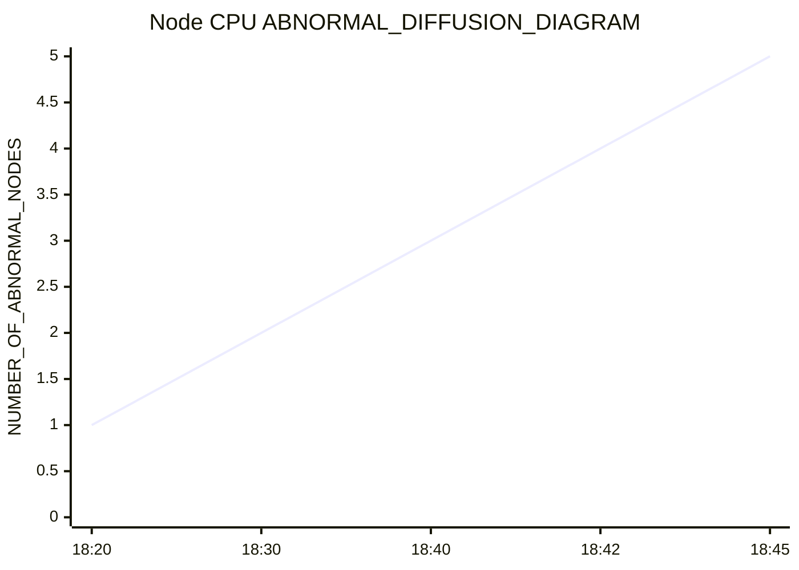
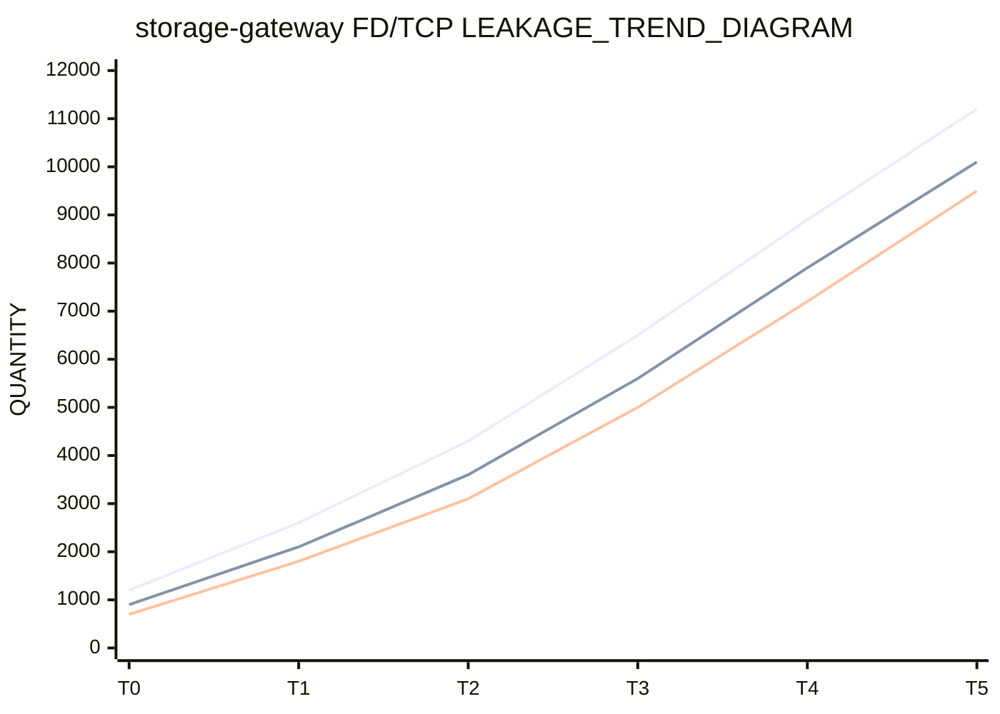
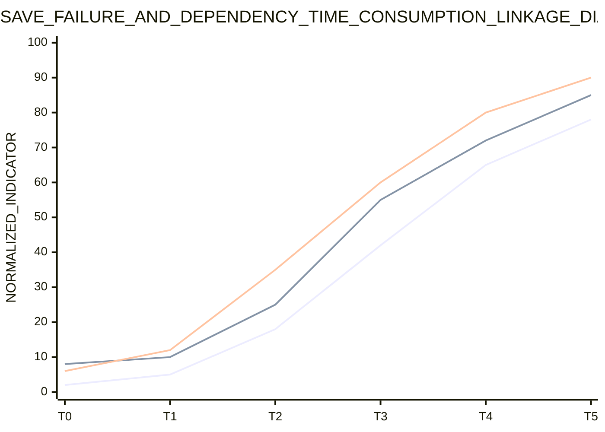
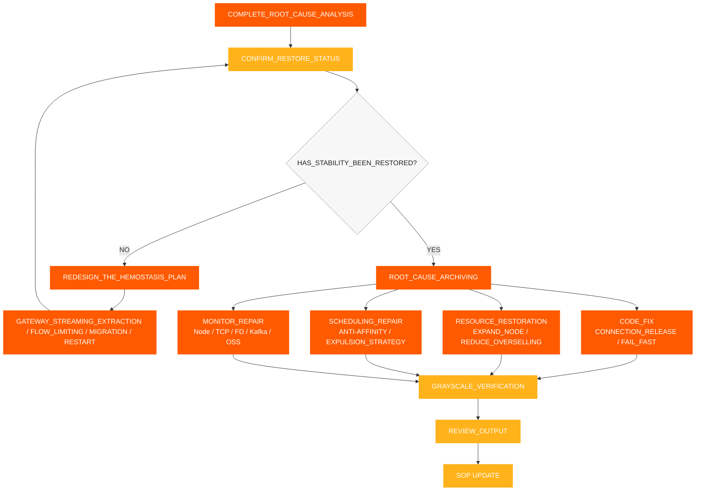

# 事件响应 SOP

[← ShimoDocs Suite 部署文档](../README.md)

## 1. 信息收集

收到故障后，首先记录以下信息：

- 发生时间：首次告警时间、首次客户反馈时间、是否与发布或扩容同时发生
- 影响范围：租户、文档类型、文件数量、用户数量、是否集中在表中或大表中
- 具体症状：保存失败、编辑错误 Kafka 超时、对象存储读取缓慢 API 超时
- 近期变更：服务发布、滚动重启、Pod扩容、节点扩容、存储或变更 Kafka 变更
- 关键服务： `svc-nodejs-fc`, `svc-edit`, `svc-edit-worker-bigmosheet`, `storage-gateway`, `ingress`, `ws-gateway`.


## 2. 信息评估与故障分类

完成信息收集后，首先根据症状、指标、事件和变更记录判断故障范围、发展趋势及主要原因方向，然后决定是否需要立即进行遏制。判断结果应形成清晰结论，不应仅依赖单个Pod或单条日志。

评估关键点：

- 用户影响范围：用户、租户、文档类型、区域及受影响的服务。
- 影响表现：保存失败、编辑延迟， API 超时， Kafka 写入超时、对象存储读取缓慢。
- 影响趋势：是否持续扩大，是否从单个Pod或节点扩散到多个节点。
- 变更关联：是否与服务发布、Pod扩缩容、节点扩缩容、滚动重启、配置或中间件变更相关。 
- 初步方向：资源、 K8s 控制平面、网关、网络、中间件、业务代码或数据问题。 

根据判断结果确定故障等级： 

| 等级 | 判断标准 | 响应目标 | 
| --- | --- | --- | 
| P0 | 核心服务中广泛的编辑不可用，持续保存失败，批量异常 | 在15分钟内止损，在30分钟内明确主要原因方向 | 
| P1 | 部分租户、部分文档、部分节点异常，错误率显著增加 | 在30分钟内定位异常环节，在60分钟内恢复稳定 | 
| P2 | 单点或小规模请求变慢，偶尔保存失败 | 在1个工作日内完成原因确认和修复方案 | 

判断结论至少应回答三个问题：当前影响有多大，故障是否在扩展，应先止损还是直接进行根因分析 




## 3. 快速止血

如果用户端持续失败，或判断结果显示故障正在扩展，先执行遏制措施，然后继续深入分析。遏制的目标是缩小故障范围，阻断资源的正反馈，同时尽可能保留故障现场

1. 将流量从异常网关移除 SLB 后端、Ingress条目、服务实例或节点，阻止新请求继续进入异常路径。
2. 将异常节点设置为不可调度或隔离，以防止Pod继续调度到高压节点。
3. 重启遇到 OOM、持续内存增长或FD/TCP 泄漏的Pod，优先处理 `storage-gateway`, `svc-nodejs-fc`和 `svc-edit-worker-bigmosheet`.
4. 分发高负载Pod以避免 `nodejs-fc`, `bigmosheet`, `ingress`和 `storage-gateway` 集中在同一节点。
5. 暂停无效业务Pod的扩缩容，优先扩缩容节点或恢复可用资源。
6. 对上游重试、连接创建和请求积累实施限流或快速失败，以防冷启动后新连接持续激增。
7. 记录节点 CPU、内存、 OOM, FD, TCP、错误率和接口延迟在止血前后的情况。

### 3.1 网关流量移除

当故障表现为异常的本地节点、本地网关条目或本地服务实例时，应首先清除异常的入口流量，然后再处理节点和 Pod。清除流量的目的是减轻故障链路的压力，并防止异常实例继续接收新的请求。 

触发条件： 

- 某个Ingress的错误率， SLB 后端、网关 Pod 或节点的数量明显高于其他实例。 
- 网关 5xx 错误、上游超时和连接重置集中在少数几个入口点。 
- 某些节点 CPU，负载， TCP，并且 FD 指标明显异常，新请求仍在不断进入。 
- 核心链路实例例如 `svc-edit`, `ws-gateway`和 `storage-gateway` 已经变慢。 

执行操作： 

1. 从 SLB、Ingress、网关路由或服务发现中移除异常的后端。 
2. 临时将异常节点标记为不可调度，以防止新的 Pod 调度到这些节点上。 
3. 进行数据包捕获、日志、FD/TCP，以及对已移除流量的节点或实例进行资源检查。 
4. 完成重启、迁移、扩容或配置修复后，先恢复到小流量负载，然后全面恢复。 
5. 恢复前，确认错误率、接口响应时间、节点/FD指标已经恢复正常。 CPU和 TCP 




## 4. 标准根因分析流程

完成快速止血并确认故障面稳定后，进行根因分析。标准排查顺序按“自下而上、自粗到细”的方式进行：

1. 基础监控：集群资源、节点、Pod资源。
2. 中间件监控： Kafka对象存储、网关、网络。
3. 业务监控：保存成功率、接口响应时间和错误率。
4. 日志监控：错误日志、超时日志、 OOM/重启日志。
5. 链路追踪：请求链路、慢调用、异常跨度。

核心要求：

- 每一层先输出判断结论，再进入下一层。
- 先看节点，再看 Pod；先看全局趋势，再看单个服务的日志。
- 不要因为某一层没有检测到异常就跳过后续层级。
- 监控、日志和追踪需要使用相同的时间窗口、Pod、节点和追踪 ID 进行关联。

每一层只回答一个核心问题：

- 基础监控：资源是否已经不足，是否存在超卖、集中调度或跨节点分布？
- 中间件监控：是否存在性能下降、积压、请求拒绝或连接异常？
- 业务监控：用户影响对应的是哪个服务、 API或文档类型？
- 日志监控：是否有明确的错误、超时、 OOM重启或连接池耗尽的证据？
- 链路追踪：失败的请求具体卡在哪——哪个服务、节点或 Span？ 


### 4.1 基础监控故障排查 

优先检查节点维度，而不仅仅是 Pod 维度。当资源被超额分配时，Pod 监控可能显示在安全范围内，但节点可能已经被完全利用。 

检查项目： 

- 集群总量 CPU 以及内存容量和可用容量。 
- 节点 CPU、内存、负载、磁盘、网络。 
- Pod CPU、内存、重启次数、 OOM, CPU 节流情况。 
- 是否有多个高 CPU 或高 IO 服务集中在单一节点上。 
- 滚动发布后，Pod 是否主要调度在前几个节点上。 
- 是否缺少反亲和性和驱逐策略。 

关键判断： 

- 总量是否 CPU 限制 / 集群 CPU 容量超过 150%。 
- 总内存限制 / 集群内存容量是否超过 120%。 
- 是否存在一个节点先失败，然后其他节点逐渐出现使用量增加的过程。 CPU 使用量。 


### 4.2 中间件监控故障排查 

中间件故障排查主要关注 Kafka、对象存储、网关和网络。具体判断为 Kafka 如下；对象存储、 `storage-gateway`、网关和网络的详细指标和判断项统一记录在第9.7节及相关检查表中。 

#### 4.2.1 Kafka 

检查项目： 

- 生产者写入延迟和失败率。 
- 主题积压。 
- Broker端 CPU、磁盘、网络和请求延迟。 
- 客户端是否存在重传、丢包或连接拥塞。 Kafka. 
- 是否只在业务端写入发生超时，而操作端没有明显异常。 Kafka 操作端。 

判断逻辑： 

- 如果操作端没有异常，但业务端持续出现写超时，重点检查业务节点 Kafka 、网络拥塞及客户端处理能力。 CPU积压和业务错误同时发生时，先确认积压是否由上游服务处理缓慢引起。 
- 如果 Kafka 。 


### 4.3 业务监控、日志与跟踪 

#### 4.3.1 业务监控 

根据客户现象确认异常环节： 

1. 保存失败是否集中在某些表、大型表或特定文档类型中。 
2. 编辑界面是否出现超时、请求变慢或错误率增加。 
3. 检查是否 `Kafka write timeout` 发生。 
4. 检查对象存储读取是否缓慢，写入是否正常。 
5. 检查是否 `bigmosheet operation oss_get` 超过5秒。 
6. 检查 WebSocket、协作编辑、历史记录和对象存储相关服务是否同时出现延迟增加。 

#### 4.3.2 日志监控 

需要检查的关键日志： 

- 编辑保存失败的日志。 
- 日志用于 Kafka 写入超时。 
- 对象存储读写缓慢的日志。 
- 日志用于 OOM, 重启、连接池耗尽以及 FD 耗尽。 
- 网关 5xx 错误、上游超时和连接重置的日志。 

#### 4.3.3 跟踪链路追踪 

使用 Trace 跟踪单个失败请求： 

- 检查请求是否卡在网关、协作编辑、对象存储、 Kafka或历史消费链中。 
- 检查是否有 Span 出现异常延迟。 
- 检查慢调用是否集中在特定服务、节点或文档类型中。 
- 比较失败请求和正常请求之间的链接差异。 


## 5. 恢复验证 

在完成止血操作后，必须验证以下指标： 

- 已移除的网关条目， SLB 后端或异常实例已停止接收新流量。 
- 保存成功率已恢复正常。 
- 编辑界面错误率已下降。 
- Kafka 写入延迟已恢复正常。 
- Kafka 积压已减少。 
- 对象存储读取延迟已恢复正常。 
- 节点 CPU内存和负载已下降。 
- `storage-gateway` FD和套接字FD不再持续增长。 
- 异常节点不再扩散。 
- 在灰度发布恢复流量后，网关5xx、上游超时和连接重置未再次上升。 


## 6. 监控和告警要求 

必须完成以下告警： 

- 节点 CPU内存、负载、磁盘和网络告警。 
- 节点 TCP 连接数、重传、包丢失和 `ESTABLISHED` 连接数告警。 
- Pod OOM重启和 CPU 限流告警。 
- 核心服务 OOM 告警。 
- CPU 超售警报： CPU 限制 / 集群 CPU 容量超过 150%。 
- 内存超售警报：内存限制 / 集群内存容量超过 120%。 
- Kafka 积压警报。 
- Kafka 写入超时警报。 
- 编辑保存失败错误日志警报。 
- `bigmosheet operation oss_get > 5s` 警报。 
- `storage-gateway` FD 和 socket FD 持续增加警报。 
- `storage-gateway` RSS / 工作集持续增加和节点 `MemoryPressure` 警报。 


## 7. 关键指标监控仪表板 

本节是辅助工具，不会改变主要流程顺序。仪表板用于观察趋势和定位方向，而 `kubectl`, `jq`和 PromQL 用于获取具体证据；现场调查应按照第 9 节的详细清单进行，执行每一项并记录结论。 

### 7.1 仪表板分层 

建议将协作编辑不可用故障仪表板分为 5 层，在调查时从上到下逐层检查： 

| 层级 | 仪表板名称 | 核心指标 | 目的 |
| --- | --- | --- | --- |
| L1 | 用户影响仪表板 | 保存成功率、编辑错误率、接口 P95/P99，在线协作连接 | 确定用户是否真正受到影响 |
| L2 | 业务服务仪表板 | QPS错误率、延迟和重启次数 `svc-edit`, `svc-nodejs-fc`, `bigmosheet` | 确定异常集中在哪个业务服务中 |
| L3 | 中间件仪表板 | Kafka 写延迟 Kafka 积压、对象存储读写延迟、上游网关延迟 | 确定依赖项是否在变慢 |
| L4 | 容器资源仪表板 | Pod CPU、内存、 OOM重启次数 CPU 限流 | 确定容器本身是否异常 |
| L5 | 节点和集群仪表盘 | 节点 CPU, 内存, 负载, TCP, FD, 过度分配资源, Pod分布 | 确定底层资源是否支持业务运行 |

### 7.2 关键指标概览图



### 7.3 资源超分配趋势图

此图用于观察是否 CPU 在扩展前后CPU和内存超分配进入高风险区域。在实际仪表盘中，建议将 CPU CPU超分配设置为150%，内存超分配设置为120% 作为告警阈值线。



### 7.4 节点 CPU 扩散趋势图

此图表用于观察是否存在扩散特征，即单个节点先失败，随后其他节点逐渐被拖垮。



### 7.5 FD/TCP 泄漏趋势图

此图表用于判断是否存在 `storage-gateway` 连接或 FD 泄漏。如果 `total_fd`, `socket_fd`，并且 `ESTABLISHED` 连接数量同时持续增加，则应优先处理连接泄漏。



### 7.6 业务错误与依赖延迟相关性图

此图表用于验证用户端保存失败是否与 Kafka 写入延迟和对象存储读取延迟增加相关。如果三个指标在同一时间窗口内同时增加，应优先检查业务节点处理能力和依赖链拥堵情况。



### 7.7 推荐报警阈值

| 指标 | 推荐阈值 | 触发后的操作 |
| --- | --- | --- |
| 保存成功率 | 连续 5 分钟低于 99% | 进入业务影响确认，关联错误日志和 Traces |
| 编辑接口 P95 | 连续 5 分钟高于基准的 2 倍 | 检查 `svc-edit`, `nodejs-fc`, `bigmosheet` |
| Kafka 写入延迟 | 高于基线两倍或发生写入超时 | 检查 Kafka 积压，业务节点 CPU，网络重传 |
| Kafka 积压 | 连续增长10分钟 | 检查消费者任务和上游写入速度 |
| OSS 读取延迟 | P95 超过5秒 | 检查 `storage-gateway`，网络，对象存储端 |
| 节点 CPU | 连续5分钟高于90% | 检查Pod分布， CPU 超额分配，高负载服务 |
| CPU 超额分配 | 超过150% | 暂停业务Pod扩展，优先评估节点扩展 |
| 内存超额分配 | 超过120% | 检查 OOM，存在驱逐风险和内存泄漏 |
| `total_fd` / `socket_fd` | 单调增加10分钟 | 检查FD/TCP 泄漏，如有必要重启以止血 |
| TCP 重传率 | 高于基线两倍 | 抓包确认丢包、拥塞、窗口问题 |
| Pod重启/ OOM | 任何核心服务发生 | 立即关联日志并发布变更 |

### 7.8 节点 CPU 及内存超额订阅查询命令

以下命令适用于业务运行在以下场景的情况 K8s 集群。在执行之前，确认当前的 kubeconfig 已切换到有故障的集群，并进行替换 `NODE_NAME` 与目标节点名称。

#### 7.8.1 检查节点实际情况 CPU 和内存使用情况

```bash
# View the real-time CPU and memory usage of all Nodes
kubectl top nodes

# View the real-time usage of the specified Node
kubectl top node "$NODE_NAME"

# View the node's capacity, allocatable resources, and pressure status
kubectl describe node "$NODE_NAME" | sed -n '/Capacity:/,/Allocatable:/p'
kubectl describe node "$NODE_NAME" | sed -n '/Conditions:/,/Addresses:/p'

# Directly view the CPU/memory Requests, Limits, and usage ratio allocated to the Node
kubectl describe node "$NODE_NAME" | sed -n '/Allocated resources:/,/Events:/p'
```

关键关注点： `CPU%`, `MEMORY%`, `MemoryPressure`, `DiskPressure`, `PIDPressure`. 当实际使用率超过90%时，需要立即根据Pod分布和网关流量移除情况判断是否需要进行限流控制。

#### 7.8.2 统计数据 CPU，指定节点的内存请求和限制

```bash
# Statistics of CPU/memory requests and limits for all Pod containers on the specified Node.
# Dependencies: kubectl, jq; memory is uniformly converted to MiB, CPU is uniformly converted to cores.
NODE_NAME="<TARGET_NODE_NAME>"

kubectl get pods -A --field-selector "spec.nodeName=${NODE_NAME}" -o json | jq '
  def cpu_core:
    if . == null then 0
    elif endswith("m") then (rtrimstr("m") | tonumber / 1000)
    else tonumber
    end;
  def mem_mib:
    if . == null then 0
    elif endswith("Ki") then (rtrimstr("Ki") | tonumber / 1024)
    elif endswith("Mi") then (rtrimstr("Mi") | tonumber)
    elif endswith("Gi") then (rtrimstr("Gi") | tonumber * 1024)
    elif endswith("Ti") then (rtrimstr("Ti") | tonumber * 1024 * 1024)
    elif endswith("K") then (rtrimstr("K") | tonumber / 1024)
    elif endswith("M") then (rtrimstr("M") | tonumber)
    elif endswith("G") then (rtrimstr("G") | tonumber * 1024)
    elif endswith("T") then (rtrimstr("T") | tonumber * 1024 * 1024)
    else (tonumber / 1024 / 1024)
    end;
  [ .items[]
    | ([(.spec.containers[]?, .spec.initContainers[]?) | .resources.requests.cpu? // "0"] | map(cpu_core) | add) as $cpu_req
    | ([(.spec.containers[]?, .spec.initContainers[]?) | .resources.limits.cpu? // "0"] | map(cpu_core) | add) as $cpu_limit
    | ([(.spec.containers[]?, .spec.initContainers[]?) | .resources.requests.memory? // "0"] | map(mem_mib) | add) as $mem_req
    | ([(.spec.containers[]?, .spec.initContainers[]?) | .resources.limits.memory? // "0"] | map(mem_mib) | add) as $mem_limit
    | {cpu_request: $cpu_req, cpu_limit: $cpu_limit, mem_request_mib: $mem_req, mem_limit_mib: $mem_limit}
  ]
  | {
      cpu_request_core: (map(.cpu_request) | add),
      cpu_limit_core: (map(.cpu_limit) | add),
      mem_request_mib: (map(.mem_request_mib) | add),
      mem_limit_mib: (map(.mem_limit_mib) | add)
    }'
```

注意：官方 K8s 调度计算使用“取最大值”规则 `initContainers`。上述命令用于快速现场汇总，适合检测明显的超量分配；在与资源仪表板或调度器数据对账时，应以平台提供的节点资源统计为标准。 

#### 7.8.3 计算集群 CPU 和内存超量分配比率 

```bash
# Get the total Allocatable resources of all nodes in the cluster
kubectl get nodes -o json | jq '
  [ .items[].status.allocatable
    | {
        cpu_core: (if (.cpu | endswith("m"))
                   then (.cpu | rtrimstr("m") | tonumber / 1000)
                   else (.cpu | tonumber)
                   end),
        memory_bytes: (.memory | rtrimstr("Ki") | tonumber * 1024)
      }
  ]
  | {
      cpu_allocatable_core: (map(.cpu_core) | add),
      memory_allocatable_gib: (map(.memory_bytes) | add / 1024 / 1024 / 1024)
    }'

# Summarize the CPU/memory limits of all Pods for calculating the overcommit ratio
kubectl get pods -A -o json | jq '
  def cpu_core:
    if . == null then 0
    elif endswith("m") then (rtrimstr("m") | tonumber / 1000)
    else tonumber
    end;
  def mem_gib:
    if . == null then 0
    elif endswith("Ki") then (rtrimstr("Ki") | tonumber / 1024 / 1024)
    elif endswith("Mi") then (rtrimstr("Mi") | tonumber / 1024)
    elif endswith("Gi") then (rtrimstr("Gi") | tonumber)
    else (tonumber / 1024 / 1024 / 1024)
    end;
  [ .items[] | .spec.containers[]?
    | {
        cpu_limit_core: (.resources.limits.cpu? // "0" | cpu_core),
        memory_limit_gib: (.resources.limits.memory? // "0" | mem_gib)
      }
  ]
  | {
      cpu_limit_core: (map(.cpu_limit_core) | add),
      memory_limit_gib: (map(.memory_limit_gib) | add)
    }'
```

计算公式： `CPU overcommit ratio = Total CPU Limits of all Pods / Total CPU Allocatable of all Nodes × 100%`; `Memory overcommit ratio = Total Memory Limits of all Pods / Total Memory Allocatable of all Nodes × 100%`。建议采取 CPU 将过度提交设置为150%，内存过度提交设置为120%作为高风险参考线，但最终阈值应根据客户环境基线来确定。 

#### 7.8.4 Prometheus / Grafana 查询语句

```promql
# Cluster CPU Limit Oversubscription Rate
100 * sum(kube_pod_container_resource_limits{resource="cpu", unit="core"})
  / sum(kube_node_status_allocatable{resource="cpu", unit="core"})

# Cluster Memory Limit Overcommit Rate
100 * sum(kube_pod_container_resource_limits{resource="memory", unit="byte"})
  / sum(kube_node_status_allocatable{resource="memory", unit="byte"})

# View CPU Limit Overcommit Rate by Node
100 * sum by (node) (kube_pod_container_resource_limits{resource="cpu", unit="core"})
  / on (node) kube_node_status_allocatable{resource="cpu", unit="core"}

# View Memory Limit Oversubscription Rate by Node
100 * sum by (node) (kube_pod_container_resource_limits{resource="memory", unit="byte"})
  / on (node) kube_node_status_allocatable{resource="memory", unit="byte"}

# Node Actual CPU Usage
100 * (1 - avg by (instance) (rate(node_cpu_seconds_total{mode="idle"}[5m])))

# Node actual memory usage
100 * (1 - node_memory_MemAvailable_bytes / node_memory_MemTotal_bytes)

# K8s node memory pressure status, 1 indicates MemoryPressure=True
kube_node_status_condition{condition="MemoryPressure", status="true"}
```

如果资源指标 `unit` 以及 `node` 在 Prometheus 中的标签名称与上述语句不一致，应先确认指标详情中的实际标签后再进行调整。过度分配比率只能指示资源声明中的潜在风险，不能替代对节点实际情况的评估。 CPU、内存、 OOM和 `MemoryPressure`.


## 8. 审查与长期整改循环




## 9. 详细检查清单 

此清单按“用户现象 → 基础资源 → K8s → 中间件 → 日志和链路 → 处理闭环”的顺序执行。每项应记录观察时间、异常对象、指标截图或查询结果，以避免只记录“正常/异常”而不进行复查。 

### 9.1 现象与影响范围确认 

| 检查对象 | 需确认的事项 | 异常判断 | 现场记录 / 结论 |
| --- | --- | --- | --- |
| 用户影响 | 协作编辑不可用，保存失败，编辑延迟，界面超时 | 多个用户、租户或文档同时异常，判定为业务故障 | |
| 故障范围 | 是否集中在表格、大型电子表格、特定文档类型、特定租户或特定区域？ | 当有明显集中时，优先按服务路由、数据类型或节点分组 | |
| 错误表现 | 是否出现“kafka 写入超时”、网关 5xx、连接重置、上游超时 | 在同一时间窗口内多种错误类型同时上升，优先关注公共依赖和资源层 | |
| 时间关联 | 首次告警、首次反馈以及指标异常开始的时间点 | 如与发布、扩容、滚动重启或配置变更同时发生，记录变更工单号 | |
| 影响规模 | 失败请求量、失败率、在线协作连接数、受影响服务及副本数 | 当影响持续扩展时，升级故障等级并先执行止损操作 | |

### 9.2 基本项目监控：节点 

| 监控对象 | 关键指标 | 关键判断 | 推荐操作 | 现场记录 / 结论 |
| --- | --- | --- | --- | --- |
| CPU 使用情况 | 节点 CPU 使用率，负载 1/5/15, CPU steal, iowait, 软中断 | CPU 持续 >90%，负载接近或超过核心数，iowait/软中断异常增加 | 检查高负载 Pods，如有必要移除流量、迁移 Pods 或扩容节点 | |
| 内存使用情况 | 已使用，可用, RSS, 页面错误, 交换区, OOM Kill | 可用内存持续下降, 交换区使用, OOM, 内存回收压力增加 | 检查内存泄漏及高内存 Pods，确认 `MemoryPressure`, 必要时隔离节点 | |
| 内存超额订阅 | 内存限制/可分配内存, 内存请求/可分配内存 | 内存限制超过 120% 或请求过于集中 | 暂停业务扩容，优先增加节点，降低高风险限制或分散 Pods | |
| CPU 超额分配 | CPU 限制/可分配内存, CPU 请求/可分配内存 | CPU 限制超过 150%，或高负载 Pods 集中在同一节点 | 调整资源配置、反亲和性和副本分布 |  |
| TCP 连接 | 总计 TCP 连接数， `ESTABLISHED`, `TIME_WAIT`, `CLOSE_WAIT`，重传率 | 连接数持续增加， `CLOSE_WAIT` 长时间未释放，重传率上升 | 定位连接泄漏、连接池、网络拥塞及异常客户端 |  |
| netstat / 套接字 | 套接字总数、监听端口、Recv-Q、Send-Q、失败连接数 | Recv-Q/Send-Q持续积累或监听队列溢出 | 通过抓包、服务连接池及内核参数排查 |  |
| 文件描述符(FD) | FD总数、套接字FD、进程FD使用情况， `file-nr` | `total_fd`, `socket_fd` 单调增加或接近进程限制 | 保存当前状态，重启泄漏服务，修复连接释放逻辑 |  |
| 磁盘 | 文件系统使用率、inode、磁盘吞吐量， IOPS，await、util、写入延迟 | 磁盘满，inode满，await/util持续高 | 清理临时文件或日志，扩展磁盘，检查镜像解压及日志写入 |  |
| 网络 | NIC 带宽，丢包，错误数据包，重传，软中断，连接跟踪表 | 带宽完全使用，丢包/重传增加，conntrack接近上限 | 检查镜像拉取、跨节点流量、网关流量和网络策略 |  |
| 节点状态 | `Ready`, `MemoryPressure`, `DiskPressure`, `PIDPressure` | 任何压力状态为真，或节点未就绪 | 首先移除节点流量，禁止调度，并保留当前状态 |  |
| Pod 分布 | 是否过高 CPU/内存服务集中在同一节点 | `svc-nodejs-fc`, `svc-edit-worker-bigmosheet`, `ingress`, `storage-gateway` 在同一节点上 | 执行网关流分离、迁移或重新调度 |  |

### 9.3 基本项目监控：Pod

| 监控对象 | 关键指标 | 关键判断点 | 推荐操作 | 现场记录 / 结论 |
| --- | --- | --- | --- | --- |
| CPU 使用情况 | Pod/容器 CPU 使用情况， CPU 节流，节流周期 | 高 CPU 使用或持续增加的节流 | 检查 CPU 限制，节点超分配，以及请求积压 |  |
| 内存使用情况 | 工作集， RSS堆，容器内存使用情况，增长斜率 | 连续内存增加并在重启后恢复，怀疑内存泄漏 | 收集堆信息和进程指标，如有必要则重启以阻止故障 |  |
| OOM 并重启 | `OOMKilled`重启次数、上次状态、重启时间 | OOM 伴随业务错误或节点压力发生 | 关联 kubelet 事件、容器日志及上游重试 |  |
| 网络连接 | Pod TCP 连接数， `ESTABLISHED`, `TIME_WAIT`, `CLOSE_WAIT` | 新连接突然激增或长连接未释放 | 检查连接池、超时、重试及服务器端连接关闭 |  |
| netstat / 套接字 | Recv-Q、Send-Q、监听端口、套接字文件描述符 | 队列积压或套接字文件描述符随内存同步增长 | 判断网络阻塞或连接泄漏 |  |
| 网络流量 | 入站/出站流量、错误包、丢包、跨节点流量 | 流量突然激增、异常重试或跨节点流量放大 | 检查网关路由、服务发现及重试策略 |  |
| 运行状态 | Ready、容器状态、探针失败、启动时间 | 探针失败、CrashLoopBackOff、冷启动减慢 | 先移除流量，再确认依赖及资源恢复，然后逐步恢复 |  |
| 副本与调度 | 可用副本、期望副本、待处理、节点分布 | 副本不足或待处理 Pod 持续增加 | 检查资源不足、污点、亲和性/反亲和性以及配额 |  |

### 9.4 K8s 监控

| 监控对象 | 关键指标 / 信息 | 关键评估 | 推荐操作 | 现场记录 / 结论 |
| --- | --- | --- | --- | --- |
| 事件信息 | Pod OOM被驱逐、探针失败、调度失败、回退、节点未就绪 | 确定是否存在批量重启、驱逐、调度失败或探针失败 | 按时间排序并与发布、节点及业务错误关联 |  |
| 调度状态 | 待处理 Pod 数量、调度时间、资源不足原因、配额使用情况 | 确定 Pod 无法调度的原因 CPU/内存不足、污点或亲和规则 | 扩展节点、调整调度策略或暂时减少非核心工作负载 |  |
| kubelet | kubelet 错误、 PLEG 延迟、Pod 启动/停止时间、镜像拉取失败 | 重新启动和镜像拉取是否已成为资源放大的来源 | 检查 kubelet、容器运行时、磁盘和网络 |  |
| API 服务器 | 请求 QPS, P95/P99，5xx，拒绝数量，工作队列 | 控制平面是否响应缓慢或正在经历限流 | 检查 APIServer、etcd 和控制平面网络 |  |
| etcd | 提交延迟、fsync 延迟、leader 变更、数据库大小、提案失败、后端提交、磁盘利用率 | 延迟、leader 选举、空间或磁盘 I/O 是否异常 | 确保 etcd 磁盘和网络稳定，避免在故障期间盲目重启 |  |
| 控制器 / 调度器 | 工作队列深度、调度失败、对账延迟、Pod 创建速率 | 控制器是否积压，副本恢复是否延迟 | 检查控制平面的负载和资源配额 |  |
| 服务 / 端点 | 端点数量、就绪地址、EndpointSlice 更新、服务发现延迟 | 由于 Pod 未就绪，有效后端是否减少 | 检查探针、服务选择器和网关后端列表 |  |
| 网络插件 | CNI 错误，Pod 网络接口， DNS 延迟，CoreDNS QPS/错误率，NetworkPolicy 丢包 | Pod、节点之间是否存在网络异常，或 DNS | 检查 CNICoreDNS、NetworkPolicy 和 conntrack |  |
| 网关和流量 | 入口流量/SLB 5xx，上游超时，连接重置，后端健康计数， QPS | 异常是否集中在特定入口、后端或节点 | 移除异常 SLB 后端、入口条目或网关实例，并在恢复过程中灰度释放流量 |  |

### 9.5 中间件监控： MySQL

| 关键指标 | 关键判断 | 推荐操作 | 现场记录 / 结论 |
| --- | --- | --- | --- |
| QPS, TPS连接数，活跃连接，连接失败 | 连接是否出现峰值、连接池耗尽或请求骤增 | 检查应用连接池、重试和慢请求 |  |
| CPU，内存，磁盘 IO，磁盘空间， IOPS，等待 | 资源是否已达到上限导致 SQL 性能下降 | 先限制或移除异常流量，然后评估伸缩 |  |
| 慢查询数量， P95/P99锁等待，死锁，未提交事务 | 是否存在锁或慢操作 SQL 放大业务时间 | 定位 SQL，事务和索引；避免直接终止未确认的事务 |  |
| 缓冲池命中率，行锁，临时表，线程数 | 是缓存不足还是排序/并发过高 | 检查 SQL 以及实例参数 |  |
| 主从延迟，复制线程，中继日志，二进制日志写入延迟 | 读写分离或复制是否异常 | 检查复制链路和流量切换 |  |

### 9.6 中间件监控： Redis

| 关键指标 | 关键判断 | 推荐操作 | 现场记录 / 结论 |
| --- | --- | --- | --- |
| QPS，命令延迟， P95/P99，慢查询 | 命令执行是否变慢或请求激增 | 定位慢命令、批量命令和热点键 | |
| 使用内存， RSS，内存碎片率，最大内存，被驱逐_键 | 内存是否接近上限，发生驱逐或异常碎片 | 检查键生命周期、驱逐策略和大键 |  |
| 已连接客户端，被阻塞_的客户端，连接被拒 | 连接池是否耗尽或阻塞命令积累 | 检查连接池、阻塞命令和客户端重试 |  |
| 命中率，Keyspace 命中/未命中，大键，热点键 | 无论是缓存击穿、穿透，还是热点集中都会加大后端压力 | 增加 TTL，热点保护或限流 |  |
| 主从复制延迟、故障切换、集群槽、网络流量 | 是否发生主从切换或集群分片异常 | 检查拓扑结构和客户端路由 |  |

### 9.7 中间件监控：对象存储与存储网关

| 关键指标 | 关键判断 | 推荐操作 | 现场记录 / 结论 |
| --- | --- | --- | --- |
| GET/PUT/HEAD 请求量、成功率、4xx/5xx | 是否为只读路径异常，或特定操作失败 | 区分对象存储端和代理端错误 |  |
| 读/写 P50/P95/P99，首字节延迟、超时次数 | 是否存在“读慢，写正常”特征 | 优先检查 `storage-gateway` 读路径和节点资源 |  |
| Pod CPU，工作集 RSS，GC，重启/OOM | 是否存在内存泄漏或GC放大 | 保存事件状态并重启，收集堆和GC信息 |  |
| `total_fd`, `socket_fd`, `ESTABLISHED`, `CLOSE_WAIT` | 是否存在未释放连接或FD持续增长 | 检查连接池、超时和响应关闭逻辑 |  |
| 连接池使用情况、等待数量、连接创建/释放速率 | 连接池是否耗尽或出现连接风暴 | 限制重试和连接创建，如有必要分流流量 |  |
| 网络重传、Recv-Q/Send-Q、对象存储错误 | 是否存在网络拥堵或上游依赖异常 | 抓包并与对象存储监控进行对比 |  |

### 9.8 中间件监控： Elasticsearch

| 关键指标 | 关键判断 | 推荐操作 | 现场记录 / 结论 |
| --- | --- | --- | --- |
| 集群健康、节点数量、分片状态、未分配分片 | 是否出现黄/红状态、分片恢复或节点离线 | 检查节点和分片分配原因 |  |
| JVM 堆内存、老年代 GC、GC 暂停、断路器 | 堆内存压力或 GC 是否导致请求超时 | 减少查询压力，检查聚合和大结果集 |  |
| 搜索/索引 QPS, P95/P99, 拒绝, 线程池队列 | 查询或写操作线程池是否积压 | 定位慢查询、批量写入和线程池拒绝 |  |
| 磁盘空间、磁盘水位线, IOPS, await, 分段合并 | 是否触发水印保护或IO瓶颈 | 清理无效索引，扩展磁盘，或调整写入速度 |  |
| 刷新、清空、事务日志、写入失败 | 写入路径是否被阻塞或失败 | 检查索引设置、批量大小和节点负载 |  |

### 9.9 中间件监控： MongoDB

| 关键指标 | 关键判断 | 推荐操作 | 现场记录 / 结论 |
| --- | --- | --- | --- |
| 操作、连接、连接使用率、连接失败 | 连接池是否耗尽或请求激增 | 检查应用连接池和重试策略 |  |
| 查询/写入延迟、慢查询、锁、队列 | 是否存在慢查询、锁等待或排队 | 检查查询计划、索引和并发情况 |  |
| WiredTiger缓存、页面错误、脏缓存、驱逐 | 是否存在缓存压力和驱逐放大IO | 检查热点数据和实例内存 |  |
| 磁盘空间、 IOPS等待，日志，磁盘延迟 | 持久化IO是否变慢 | 评估磁盘扩展、IO能力和写入速度 |  |
| 复制延迟、Oplog窗口、主节点选举、复制状态 | 是否存在副本延迟或频繁的主节点选举 | 检查网络、节点健康状况和副本集状态 |  |

### 9.10 日志监控与追踪

| 检查对象 | 关键内容 | 关键判断 | 现场记录/结论 |
| --- | --- | --- | --- |
| 网关日志 | 5xx、上游超时、连接重置、后端地址、请求时长 | 错误是否集中在某个入口、节点或后端 |  |
| 业务日志 | 保存失败、编辑接口超时 `kafka write timeout`, `oss_get` 慢调用 | 用户现象与依赖异常是否可关联 |  |
| 容器日志 | 前后日志 OOM启动日志、连接池耗尽、重试日志 | 是否 OOM冷启动或重试形成时间链 |  |
| K8s /kubelet 日志 | 被驱逐、调度失败、镜像拉取失败、探针失败、容器终止原因 | 平台层是否存在放大因素 |  |
| 中间件日志 | MySQL/Redis/OSS/ES/Mongo 超时、拒绝、主节点选举、副本和磁盘错误 | 依赖方是否真的有异常 |  |
| 追踪 | 请求入口、服务节点、慢速 Span、错误 Span、重试次数 | 慢调用卡在何层，是否集中在异常节点 |  |
| 日志关联 | 时间、Trace ID、Pod、节点、租户、文档类型 | 单个失败请求是否能识别具体资源 |  |

### 9.11 止血、恢复及事后分析循环

| 阶段 | 必检项 | 完成标准 | 现场记录 / 结论 |
| --- | --- | --- | --- |
| 流量移除 | SLB 后端、Ingress 入口、网关实例、异常节点 | 异常实例停止接收新流量，错误率不再上升 |  |
| 资源止血 | 高压节点 OOM Pods、泄漏服务、镜像拉取压力 | 节点 CPU/内存/IO 缓解 OOM 不再持续发生 |  |
| 服务恢复 | 副本数、Ready 状态、探针、冷启动时间、连接池 | 核心服务副本稳定 API 成功率恢复 |  |
| 依赖恢复 | Kafka, MySQL, Redis, OSSES、Mongo | 延迟、错误率、队列/积压恢复到基线 |  |
| 逐步流量增加 | 按入口、节点、租户或实例逐步恢复 | 观察错误率， P95、资源和每个阶段的重试情况 |  |
| 根本原因确认 | 指标、日志、跟踪、变更记录和现场证据 | 根本原因解释用户影响、传播过程和恢复结果 |  |
| 长期修复 | 代码、资源、调度、监控、警报和容量规划 | 通过渐进式发布或压力测试完成并验证修复 |  |
| 文档 | 事件时间线、影响范围、操作、指标截图、责任人 | 创建事后报告并更新此内容 SOP |  |
